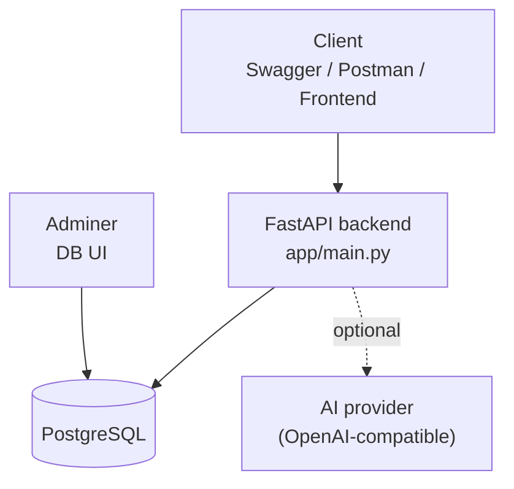

# NGO Financial Management System

AI-powered financial management platform for NGOs, focused on **structured bookkeeping**, **document-to-data extraction**, and **German compliance needs** (GoBD-oriented, GDPR-aware).

[](https://www.python.org/)
[](https://fastapi.tiangolo.com/)
[](https://www.postgresql.org/)
[](https://www.docker.com/)

## Contents

- [Why this exists](#why-this-exists)
- [Key features](#key-features)
- [Quick start (Docker)](#quick-start-docker)
- [Configuration](#configuration)
- [Architecture](#architecture)
- [API](#api)
- [Database & migrations](#database--migrations)
- [Documentation](#documentation)
- [Roadmap](#roadmap)

---

## Why this exists

NGOs often manage finances across invoices, receipts, event expenses, grants, and contractor fees. This project provides a backend foundation for:

- structured financial records in PostgreSQL
- a REST API for CRUD and reporting workflows
- optional document-to-data extraction for uploaded PDFs

## Key features

- FastAPI backend (app/main.py)
- PostgreSQL 15 + SQLAlchemy ORM
- Alembic migrations
- Docker Compose local stack (backend + Postgres + Adminer)
- Optional AI extraction controlled via environment variables

## Quick start (Docker)

```bash
cp .env.example .env
docker-compose up --build
```

Local URLs:

- Swagger UI: http://localhost:8000/docs
- ReDoc: http://localhost:8000/redoc
- Adminer (DB UI): http://localhost:8090

Adminer login:

- System: `PostgreSQL`
- Server: `postgres`
- Username: `ngo_user`
- Password: `secure_password`
- Database: `ngo_db`

## Configuration

Configuration is via environment variables in `.env` (template: `.env.example`).

- Required: `DATABASE_URL`
- Optional (enables AI extraction): `OPENAI_API_KEY`, `OPENAI_MODEL` (default is `gpt-4o-mini`)

## Architecture



## API

- Swagger UI: http://localhost:8000/docs
- Health: http://localhost:8000/health
- Endpoint details: [docs/API.md](docs/API.md)

Example:

```bash
curl -X POST "http://localhost:8000/organizations" \
  -H "Content-Type: application/json" \
  -d '{"name":"Green Earth NGO","email":"contact@greenearth.de","country":"Germany"}'
```

## Database & migrations

The database schema is managed via Alembic.

```bash
alembic upgrade head
```

When using Docker Compose:

```bash
docker exec -it ngo_backend alembic upgrade head
```

## Roadmap

- Authentication & authorization (JWT + roles)
- GoBD-oriented exports (Excel/PDF)
- Stronger automated tests + CI

---

## Next steps

### For Development
1. Add authentication (JWT)
2. Implement user roles
3. Add document categorization
4. Create financial dashboard
5. Add export to Excel/PDF

### For Production
1. Set up CI/CD pipeline
2. Configure production database
3. Add monitoring/logging
4. Implement backup strategy
5. Deploy to cloud

---

## Performance

- **API Response Time**: <100ms (average)
- **Document Processing**: 2-5 seconds (depends on file size)
- **AI Extraction**: 3-8 seconds (OpenAI API latency)
- **Concurrent Requests**: Supports async processing

---

## Support

For questions about this project:
- Check Swagger UI: http://localhost:8000/docs
- View database: http://localhost:8090 (Adminer)

---

Built with FastAPI, PostgreSQL, and OpenAI-compatible tooling.
