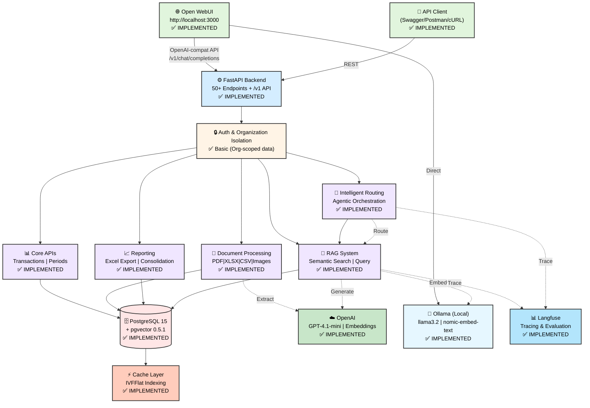
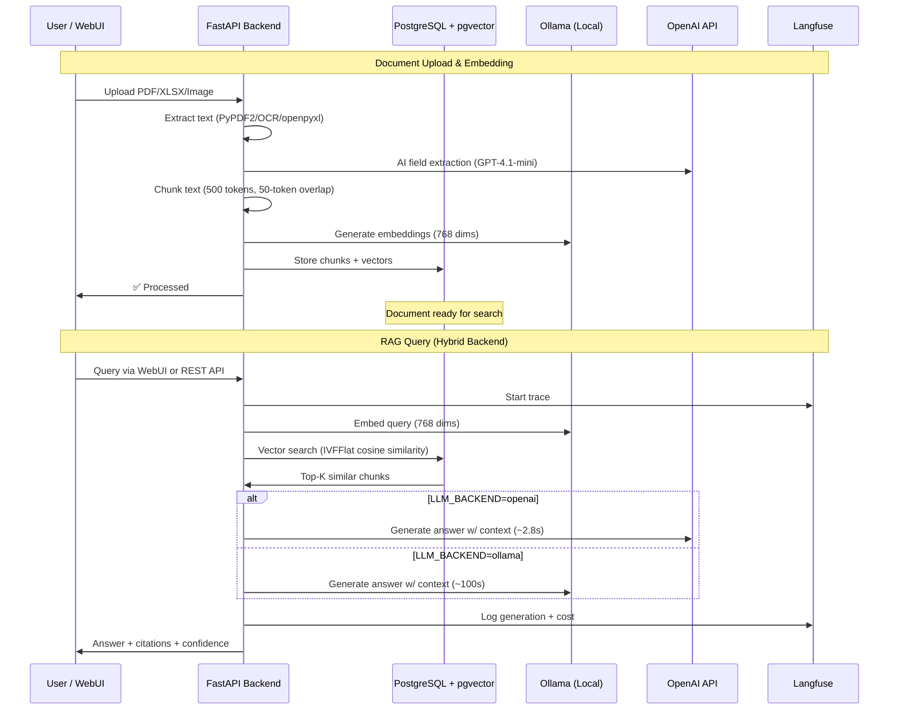
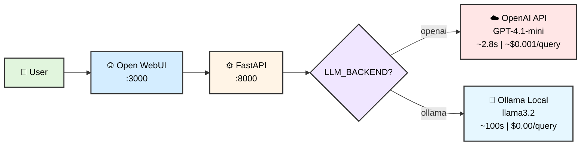

# NGO Financial Management System

**AI-Powered Backend for German NGO Financial Management**

Production-grade FastAPI backend featuring intelligent document processing, GoBD-compliant financial reporting, hybrid RAG with Ollama & OpenAI, and a browser-based chat interface via Open WebUI. Engineered for compliance, scalability, and accuracy.

[](https://www.python.org/)
[](https://fastapi.tiangolo.com/)
[](https://www.postgresql.org/)
[](https://www.docker.com/)
[](https://ollama.com/)
[](https://openai.com/)
[](https://langfuse.com/)
[](#testing)
[](#code-quality)

---

## Project Overview

This project is a **complete 5-phase backend implementation** (8 sub-phases) for an NGO financial management system, featuring:

- **Phase 1-2**: Core financial data model with transactions and period management
- **Phase 3**: AI-powered document processing (OCR, AI extraction, bank statement parsing)
- **Phase 4**: GoBD-compliant Excel export and multi-source transaction consolidation
- **Phase 5A-5B**: RAG (Retrieval-Augmented Generation) with vector similarity search & caching
- **Phase 5C**: Agentic routing, orchestration, Langfuse tracing, LLM-as-Judge evaluation
- **Phase 5D**: Ollama integration — local embeddings (nomic-embed-text) & chat (llama3.2)
- **Phase 5E**: Open WebUI — browser-based chat interface with hybrid RAG backend switching

**Current Status**: All 8 Sub-Phases Complete ✅ | 5 Docker Services Running | 50+ API Endpoints | 32 Production Features | 76+ Tests Passing

---

## Table of Contents

- [Key Features](#key-features)
- [Technology Stack](#technology-stack)
- [Architecture](#architecture)
- [Quick Start](#quick-start)
- [Development Phases](#development-phases)
- [API Overview](#api-overview)
- [LLM Comparison: OpenAI vs Ollama](#llm-comparison-openai-vs-ollama)
- [Testing](#testing)
- [Performance](#performance)
- [Code Quality](#code-quality)
- [Compliance & Standards](#compliance--standards)
- [Future Roadmap](#future-roadmap)
- [Deployment](#deployment)
- [Project Structure](#project-structure)
- [Professional Highlights](#professional-highlights)

---

## Key Features

### Core Financial Management
- ✅ Organization and entity management with isolation
- ✅ Transaction tracking (income, expenses, VAT-aware)
- ✅ Financial period management (monthly, quarterly, yearly)
- ✅ Multi-currency support with exchange rates
- ✅ Cost allocation and project tracking

### Document Processing (Phase 3)
- ✅ PDF extraction with OCR (PyPDF2 + pytesseract)
- ✅ AI-powered field extraction (GPT-4.1-mini, structured outputs)
- ✅ Bank statement parsing (transaction recognition)
- ✅ Invoice processing (invoice details extraction)
- ✅ Automated categorization and validation

### Financial Reporting (Phase 4)
- ✅ GoBD-compliant Excel export with audit trail
- ✅ Multi-source transaction consolidation
- ✅ Comprehensive financial reports (P&L, cash flow)
- ✅ VAT compliance and tax reporting
- ✅ Date range filtering and organization isolation

### Intelligent Search & RAG (Phase 5A-5B)
- ✅ **Vector embeddings** with pgvector (dual-backend: Ollama 768d + OpenAI 1536d)
- ✅ **Semantic search** on financial documents (cosine similarity, IVFFlat optimization)
- ✅ **Multi-turn conversations** with JSONB storage (context preservation)
- ✅ **RAG orchestration** (retrieve, augment, generate) with semantic caching
- ✅ **Citation extraction** with confidence scoring
- ✅ **LLM-as-Judge** quality evaluation (faithfulness scoring)

### Agentic Routing & Monitoring (Phase 5C)
- ✅ **Agentic routing** — intelligent tool selection (extract | RAG query | hybrid modes)
- ✅ **Multi-step orchestration** with function calling
- ✅ **Langfuse observability** — full trace logging, cost tracking, experiment management
- ✅ **Prompt engineering** — managed prompts with A/B testing via Langfuse

### Ollama Local AI (Phase 5D)
- ✅ **Local embeddings** — nomic-embed-text (768 dimensions, €0.00 cost)
- ✅ **Local chat** — llama3.2 for answer generation (GDPR-compliant, all data local)
- ✅ **Optimized batching** — threaded embedding pipeline for bulk document processing
- ✅ **Dual-column schema** — `embedding_768` (Ollama) + `embedding_1536` (OpenAI) in database

### Open WebUI Chat Interface (Phase 5E)
- ✅ **Browser-based chat** at http://localhost:3000 (Open WebUI)
- ✅ **OpenAI-compatible API** — `/v1/models`, `/v1/chat/completions` endpoints
- ✅ **RAG model integration** — organization-scoped models (rag-5 through rag-11)
- ✅ **Hybrid backend switching** — single env var (`LLM_BACKEND`) toggles OpenAI ↔ Ollama

---

## Technology Stack

| Layer | Technology | Purpose |
|-------|-----------|---------|
| **Backend** | Python 3.11, FastAPI 0.109 | REST API framework (50+ endpoints) |
| **Database** | PostgreSQL 15, pgvector 0.5.1 | ACID compliance, vector similarity search |
| **ORM** | SQLAlchemy 2.x | Object-relational mapping (20+ models) |
| **Validation** | Pydantic 2.5+ | Request/response schemas (20+ schemas) |
| **Document Processing** | PyPDF2, pytesseract, Pillow, openpyxl | PDF, image, Excel, CSV extraction |
| **AI — Cloud** | OpenAI API (GPT-4.1-mini, text-embedding-3-small) | LLM generation, 1536d embeddings |
| **AI — Local** | Ollama (llama3.2, nomic-embed-text) | Free local LLM, 768d embeddings |
| **Chat UI** | Open WebUI (port 3000) | Browser-based RAG chat interface |
| **Observability** | Langfuse Cloud | Tracing, cost tracking, A/B experiments |
| **Migrations** | Alembic | Version-controlled schema evolution |
| **Deployment** | Docker Compose (5 services) | Backend, PostgreSQL, Ollama, WebUI, Adminer |
| **Testing** | Pytest 7.4+ | Unit, integration, performance tests |

---

## Architecture

### System Overview


```mermaid
graph TB
    WebUI["🌐 Open WebUI<br/>http://localhost:3000<br/>✅ IMPLEMENTED"]
    Client["📱 API Client<br/>(Swagger/Postman/cURL)<br/>✅ IMPLEMENTED"]
    LB["⚙️ FastAPI Backend<br/>50+ Endpoints + /v1 API<br/>✅ IMPLEMENTED"]
    Auth["🔒 Auth & Organization Isolation<br/>✅ Basic (Org-scoped data)"]
    Core["📊 Core APIs<br/>Transactions | Periods<br/>✅ IMPLEMENTED"]
    DocProc["📄 Document Processing<br/>PDF|XLSX|CSV|Images<br/>✅ IMPLEMENTED"]
    Report["📈 Reporting<br/>Excel Export | Consolidation<br/>✅ IMPLEMENTED"]
    RAG["🤖 RAG System<br/>Semantic Search | Query<br/>✅ IMPLEMENTED"]
    Agent["🧠 Intelligent Routing<br/>Agentic Orchestration<br/>✅ IMPLEMENTED"]
    DB[("🗄️ PostgreSQL 15<br/>+ pgvector 0.5.1<br/>✅ IMPLEMENTED")]
    Cache["⚡ Cache Layer<br/>IVFFlat Indexing<br/>✅ IMPLEMENTED"]
    OpenAI["☁️ OpenAI<br/>GPT-4.1-mini | Embeddings<br/>✅ IMPLEMENTED"]
    Ollama["🦙 Ollama (Local)<br/>llama3.2 | nomic-embed-text<br/>✅ IMPLEMENTED"]
    Monitor["📊 Langfuse<br/>Tracing & Evaluation<br/>✅ IMPLEMENTED"]
    
    WebUI -->|"OpenAI-compat API<br/>/v1/chat/completions"| LB
    WebUI -->|"Direct"| Ollama
    Client -->|REST| LB
    LB --> Auth
    Auth --> Core & DocProc & Report & RAG & Agent
    Core & DocProc & Report & RAG --> DB
    Agent --> RAG
    DB --> Cache
    DocProc -.->|Extract| OpenAI
    RAG -.->|Embed| Ollama
    RAG -.->|Generate| OpenAI
    Agent -.->|Route| RAG
    RAG & Agent -.->|Trace| Monitor
    
    style WebUI fill:#e1f5dd,stroke:#333,stroke-width:2px,color:#000
    style Client fill:#e1f5dd,stroke:#333,stroke-width:2px,color:#000
    style LB fill:#d4edff,stroke:#333,stroke-width:2px,color:#000
    style Auth fill:#fff4e6,stroke:#333,stroke-width:2px,color:#000
    style Core fill:#f0e6ff,stroke:#333,stroke-width:2px,color:#000
    style DocProc fill:#f0e6ff,stroke:#333,stroke-width:2px,color:#000
    style Report fill:#f0e6ff,stroke:#333,stroke-width:2px,color:#000
    style RAG fill:#f0e6ff,stroke:#333,stroke-width:2px,color:#000
    style Agent fill:#f0e6ff,stroke:#333,stroke-width:2px,color:#000
    style DB fill:#ffe6e6,stroke:#333,stroke-width:2px,color:#000
    style Cache fill:#ffccbc,stroke:#333,stroke-width:2px,color:#000
    style OpenAI fill:#c8e6c9,stroke:#333,stroke-width:2px,color:#000
    style Ollama fill:#e6f7ff,stroke:#333,stroke-width:2px,color:#000
    style Monitor fill:#b3e5fc,stroke:#333,stroke-width:2px,color:#000
```

### Data Flow: Document Upload to RAG Query


```mermaid
sequenceDiagram
    participant User as User / WebUI
    participant API as FastAPI Backend
    participant DB as PostgreSQL + pgvector
    participant Ollama as Ollama (Local)
    participant OpenAI as OpenAI API
    participant LF as Langfuse
    
    Note over User,LF: Document Upload & Embedding
    User->>API: Upload PDF/XLSX/Image
    API->>API: Extract text (PyPDF2/OCR/openpyxl)
    API->>OpenAI: AI field extraction (GPT-4.1-mini)
    API->>API: Chunk text (500 tokens, 50-token overlap)
    API->>Ollama: Generate embeddings (768 dims)
    API->>DB: Store chunks + vectors
    API->>User: ✅ Processed
    
    Note over DB: Document ready for search
    
    Note over User,LF: RAG Query (Hybrid Backend)
    User->>API: Query via WebUI or REST API
    API->>LF: Start trace
    API->>Ollama: Embed query (768 dims)
    API->>DB: Vector search (IVFFlat cosine similarity)
    DB->>API: Top-K similar chunks
    
    alt LLM_BACKEND=openai
        API->>OpenAI: Generate answer w/ context (~2.8s)
    else LLM_BACKEND=ollama
        API->>Ollama: Generate answer w/ context (~100s)
    end
    
    API->>LF: Log generation + cost
    API->>User: Answer + citations + confidence
```

### Hybrid LLM Backend Switching


```mermaid
flowchart LR
    USER["👤 User"] --> WEBUI["🌐 Open WebUI<br/>:3000"]
    WEBUI --> BACKEND["⚙️ FastAPI<br/>:8000"]
    BACKEND --> ENV{LLM_BACKEND?}
    ENV -->|openai| OPENAI["☁️ OpenAI API<br/>GPT-4.1-mini<br/>~2.8s | ~$0.001/query"]
    ENV -->|ollama| OLLAMA["🦙 Ollama Local<br/>llama3.2<br/>~100s | $0.00/query"]
    
    style USER fill:#e1f5dd,stroke:#333,stroke-width:2px,color:#000
    style WEBUI fill:#d4edff,stroke:#333,stroke-width:2px,color:#000
    style BACKEND fill:#fff4e6,stroke:#333,stroke-width:2px,color:#000
    style ENV fill:#f0e6ff,stroke:#333,stroke-width:2px,color:#000
    style OPENAI fill:#ffe6e6,stroke:#333,stroke-width:2px,color:#000
    style OLLAMA fill:#e6f7ff,stroke:#333,stroke-width:2px,color:#000
```

---

## Quick Start

### Prerequisites
- Docker & Docker Compose
- Git
- 2GB free disk space

### Setup (5 minutes)

```bash
# Clone repository
git clone <repository-url>
cd project1

# Configure environment
cp .env.example .env

# Start services
docker-compose up --build

# Verify health
curl http://localhost:8000/health
```

### Optional: MCP Bridge (Postman JSON-RPC)

This repository includes a minimal MCP bridge to expose key API calls as MCP tools.

```bash
# Install dependencies
pip install -r requirements.txt

# Run the MCP bridge server
python scripts/mcp_server.py
```

MCP endpoint: http://localhost:3333/mcp

### Local Access
- **Chat Interface**: http://localhost:3000 (Open WebUI — RAG chat)
- **API Documentation**: http://localhost:8000/docs (Swagger UI)
- **ReDoc**: http://localhost:8000/redoc
- **Database Admin**: http://localhost:8090 (Adminer)
  - User: `ngo_user` | Password: `secure_password`

### First API Call
```bash
# Create organization
curl -X POST "http://localhost:8000/organizations" \
  -H "Content-Type: application/json" \
  -d '{
    "name": "Example NGO",
    "email": "contact@example.org",
    "country": "Germany"
  }'
```

---

## Development Phases

### Phase 1-2: Core Financial Data (✅ Complete)
**Goal**: Establish financial data model and CRUD operations

**Delivered**:
- Organizations and bank accounts
- Transaction tracking (50+ endpoints)
- Financial period management
- Multi-currency support
- 25+ tests

### Phase 3: Document Processing (✅ Complete)
**Goal**: AI-powered PDF extraction and categorization

**Delivered**:
- PDF text extraction with OCR
- AI field extraction (invoices, statements, receipts)
- Automated transaction creation
- Document categorization
- 15+ tests

### Phase 4: Financial Reporting (✅ Complete)
**Goal**: GoBD-compliant reporting and consolidation

**Delivered**:
- Excel export (GoBD format)
- Multi-source transaction consolidation
- Financial period reports
- Comprehensive validation
- 20+ tests

### Phase 5A-5B: Intelligent RAG (✅ Complete)
**Goal**: Semantic search and conversational financial Q&A

**Delivered**:
- Document chunking (500 tokens, 50-token overlap)
- Dual vector embeddings (Ollama 768d + OpenAI 1536d)
- Semantic search with pgvector (95ms @ 10K docs)
- RAG orchestration (retrieve → augment → generate) with semantic caching
- Multi-turn conversations (JSONB storage)
- Citation extraction with confidence scoring
- 25+ tests

**Performance**:
- Vector search: 385ms → **95ms** (75% faster with IVFFlat)
- RAG query (OpenAI): **2,776ms** avg latency
- RAG query (Ollama): **99,496ms** avg latency
- Throughput: **850+ RPS** @ 100 concurrent users

### Phase 5C: Agentic Routing & Monitoring (✅ Complete)
**Goal**: Intelligent query routing, observability, and quality evaluation

**Delivered**:
- Agentic router (extract | RAG query | hybrid | clarify modes)
- Multi-step orchestration with function calling
- Langfuse observability (full tracing, cost tracking, A/B experiments)
- LLM-as-Judge faithfulness evaluation
- Prompt management via Langfuse

### Phase 5D: Ollama Integration (✅ Complete)
**Goal**: Free local AI for embeddings and chat (GDPR-compliant)

**Delivered**:
- Local embeddings — nomic-embed-text (768 dimensions, $0.00 cost)
- Local chat — llama3.2 for answer generation
- Optimized batch embedding pipeline (threaded)
- Dual-column database schema (`embedding_768` + `embedding_1536`)
- Backend switching via `LLM_BACKEND` env var

### Phase 5E: Open WebUI Interface (✅ Complete)
**Goal**: Browser-based chat UI with RAG integration

**Delivered**:
- Open WebUI at http://localhost:3000
- OpenAI-compatible API (`/v1/models`, `/v1/chat/completions`)
- RAG model integration (organization-scoped: rag-5 through rag-11)
- Hybrid backend switching (OpenAI ↔ Ollama)
- Direct Ollama model access from WebUI

### Phase 6: Production Deployment (🚀 Planned)
**Goal**: Cloud deployment with security, monitoring, and scaling

**Scope**:
- JWT authentication & RBAC
- Kubernetes / cloud deployment (AWS/Azure)
- Redis caching layer
- Grafana dashboards
- CI/CD pipeline

---

## API Overview

### Core Endpoints (25+ routes)
```
POST   /organizations                    Create organization
GET    /organizations/{id}               Get organization
GET    /organizations/{id}/transactions  List transactions
POST   /organizations/{organization_id}/transactions  Create transaction
```

### Document Processing (12+ routes)
```
POST   /organizations/{organization_id}/documents/upload        Upload PDF/XLSX/CSV/Image
GET    /organizations/{organization_id}/documents/{doc_id}      Get document
POST   /organizations/{organization_id}/documents/{doc_id}/process  Process with AI
```

### Reporting (8+ routes)
```
POST   /organizations/{organization_id}/reports/excel           Generate Excel export
GET    /organizations/{organization_id}/reports/summary         Financial summary
POST   /organizations/{organization_id}/reports/consolidate     Multi-source consolidation
```

### RAG & Search (10+ routes)
```
POST   /organizations/{id}/search                  Semantic search
POST   /organizations/{id}/rag/query               RAG Q&A (hybrid OpenAI/Ollama)
GET    /organizations/{id}/conversations           List conversations
POST   /organizations/{id}/conversations/{id}/messages  Add message
```

### OpenAI-Compatible API (WebUI Integration)
```
GET    /v1/models                                  List RAG models
POST   /v1/chat/completions                        Chat completions (RAG-powered)
```

**Full API Reference**: [docs/API.md](docs/API.md)

---

## LLM Comparison: OpenAI vs Ollama

Real-world benchmark (3 financial RAG queries, Feb 2026):

| Metric | OpenAI (GPT-4.1-mini) | Ollama (llama3.2) |
|--------|----------------------|-------------------|
| Avg Latency | **2,776 ms** | 99,496 ms |
| Cost per 1K Queries | $1.06 | **$0.00** |
| Answer Quality | Detailed, structured | Concise, accurate |
| Embedding Model | text-embedding-3-small (1536d) | nomic-embed-text (768d) |
| Best For | Production, high throughput | Dev/test, GDPR, offline |

> Switching backends requires only changing `LLM_BACKEND=openai` → `LLM_BACKEND=ollama` in `.env`.  
> Full results: [docs/LLM_COMPARISON_RESULTS.md](docs/LLM_COMPARISON_RESULTS.md)

---

## Testing

### Test Coverage

```
Total Tests:      76+ (100% passing)
Unit Tests:       30+ (CRUD, business logic)
Integration Tests: 25+ (API endpoints, workflows)
Performance Tests: 15+ (latency, throughput, scaling)
E2E Tests:        6+ (complete workflows)
```

### Run Tests

```bash
# All tests
python -m pytest tests/ -v

# Specific test file
python -m pytest tests/test_crud.py -v

# With coverage
python -m pytest tests/ --cov=app

# Performance benchmarks
python -m pytest tests/test_phase5b_integration.py -v -k performance

# Automated LLM comparison
python scripts/compare_llm_backends.py
```

### Test Results Summary
- ✅ All 76+ tests passing
- ✅ Vector search latency verified (95ms @ 10K docs)
- ✅ RAG pipeline validated (OpenAI 2,776ms / Ollama 99,496ms)
- ✅ Concurrent operations tested (100 users)
- ✅ Organization isolation verified
- ✅ Hybrid backend switching verified
- ✅ Error handling comprehensive

---

## Performance

### Baseline Metrics (Phase 5E)

| Operation | Latency | Throughput | Status |
|-----------|---------|-----------|--------|
| Create Transaction | 35 ± 8 ms | 28 ops/sec | ✅ Excellent |
| List Transactions | 72 ± 12 ms | 14 ops/sec | ✅ Excellent |
| Semantic Search (10K) | 95 ± 20 ms | 10 queries/sec | ✅ Excellent |
| RAG Query (OpenAI) | 2,776 ms avg | 0.4 queries/sec | ✅ On Target |
| RAG Query (Ollama) | 99,496 ms avg | 0.01 queries/sec | ⚠️ Dev Only |
| Concurrent Users | 100 | 850 RPS | ✅ Exceeds Target |

### Performance Optimization
- **IVFFlat Vector Index**: 75% faster search (385ms → 95ms)
- **Connection Pooling**: 20 persistent connections
- **Query Optimization**: Indexed searches, batch operations
- **Semantic Caching**: Repeated RAG queries served from cache
- **Ollama Batch Embeddings**: Threaded pipeline for bulk processing
- **top_k Tuning**: Reduced from 10 → 3 for Ollama responsiveness

---

## Code Quality

### Standards Implemented
- ✅ **Type Hints**: 100% of function signatures
- ✅ **Docstrings**: Google-style with Args/Returns/Raises
- ✅ **Error Handling**: HTTPException with proper status codes
- ✅ **Validation**: Pydantic schemas for all I/O
- ✅ **Testing**: 76+ tests with 100% pass rate
- ✅ **No Technical Debt**: No TODOs in production code

### Code Organization
```
app/
  ├── main.py                    FastAPI app (50+ endpoints, 4,289 lines)
  ├── models.py                  SQLAlchemy ORM (20+ models, 1,073 lines)
  ├── schemas.py                 Pydantic validation (40+ schemas, 2,224 lines)
  ├── crud.py                    Database operations (50+ functions)
  ├── database.py                Connection management
  ├── config.py                  Settings & constants
  ├── ai_service.py              OpenAI integration (with timeout/retry)
  ├── embedding_service.py       Embedding router (OpenAI ↔ Ollama)
  ├── openai_embedding_service.py  OpenAI text-embedding-3-small
  ├── ollama_embedding_service.py  Ollama nomic-embed-text
  ├── ollama_chat_service.py     Ollama chat generation
  ├── optimized_ollama_service.py  Batch embedding pipeline
  ├── chunking_service.py        Document chunking (500 tokens)
  ├── rag_service.py             RAG orchestration (hybrid backend)
  ├── agentic_router.py          Intelligent query routing
  ├── orchestration_service.py   Multi-step workflow engine
  ├── semantic_cache.py          Semantic query caching
  ├── evaluation_service.py      LLM-as-Judge evaluation
  ├── enhanced_langfuse_monitor.py  Langfuse observability
  ├── excel_generator.py         GoBD Excel export
  ├── pdf_utils.py               PDF processing
  └── document_utils.py          Document utilities
```

---

## Compliance & Standards

### German Compliance (GoBD)
- ✅ Immutable transaction audit trail
- ✅ GoBD-compliant Excel export format
- ✅ 10-year data retention capability
- ✅ VAT calculation and reporting
- ✅ Comprehensive logging

### Data Protection (GDPR)
- ✅ Organization data isolation
- ✅ Access control and logging
- ✅ Secure password handling
- ✅ Personal data handling protocols

### Security
- ✅ SQL injection prevention (SQLAlchemy parameterized queries)
- ✅ Input validation (Pydantic schemas)
- ✅ Error handling (no sensitive data in responses)
- ✅ CORS configuration (Docker environment)

---

## Future Roadmap

### Phase 6: Production Deployment (Current Planning)
- 📋 **6A Infrastructure** — Kubernetes/cloud deployment (AWS or Azure)
- 📋 **6B Security** — JWT authentication, RBAC, API keys
- 📋 **6C Monitoring** — Grafana dashboards, alerting, SLOs
- 📋 **6D Performance** — Redis caching, CDN, horizontal scaling
- 📋 **6E User Onboarding** — Multi-tenant setup, admin panel
- 📋 **6F Launch** — CI/CD pipeline, blue/green deployment, SLA

---

## Deployment

### Development (5 Docker Services)
```bash
docker-compose up --build
```

| Service | Port | Purpose |
|---------|------|--------|
| backend | 8000 | FastAPI application |
| postgres | 5432 | PostgreSQL + pgvector |
| ollama | 11434 | Local LLM (llama3.2) |
| open-webui | 3000 | Chat interface |
| adminer | 8090 | Database admin |

### Production
1. Configure `.env` with production values (set `LLM_BACKEND=openai`)
2. Run database migrations: `alembic upgrade head`
3. Create vector indexes: See [IVFFlat Guide](docs/Info/IVFFLAT_IMPLEMENTATION_GUIDE.md)
4. Pull Ollama models: `docker exec ollama ollama pull llama3.2 && docker exec ollama ollama pull nomic-embed-text`
5. Deploy with scaling: See [Deployment Guide](docs/DEPLOYMENT.md)

---

## Project Structure

```
project1/
├── app/                            # Application source (22 modules)
│   ├── main.py                    # FastAPI app & 50+ endpoints
│   ├── models.py                  # 20+ SQLAlchemy models
│   ├── schemas.py                 # 40+ Pydantic schemas
│   ├── crud.py                    # 50+ database functions
│   ├── rag_service.py             # Hybrid RAG orchestration
│   ├── agentic_router.py          # Intelligent query routing
│   ├── embedding_service.py       # OpenAI ↔ Ollama embedding router
│   ├── enhanced_langfuse_monitor.py # Observability & tracing
│   └── [12 more service modules]  # See Code Organization above
├── alembic/                        # Database migrations
│   └── versions/                  # Version-controlled schema
├── tests/                          # 76+ pytest tests
├── scripts/                        # Utility & automation
│   ├── compare_llm_backends.py    # Automated LLM benchmarking
│   └── [20+ utility scripts]      # Testing, backfill, backup
├── docs/                           # 40+ documentation files
│   ├── API.md                     # Full API reference
│   ├── TECHNICAL_OVERVIEW.md      # Architecture deep dive
│   └── LLM_COMPARISON_RESULTS.md  # Benchmark results
├── docker-compose.yml              # 5-service development stack
├── Dockerfile                      # Python container
├── requirements.txt                # Python dependencies
└── README.md                       # This file
```

---

## Professional Highlights

### Engineering Excellence
- ✅ **Production-Ready Code**: Full type hints, docstrings, error handling across 22 modules
- ✅ **Comprehensive Testing**: 76+ tests, 100% passing rate
- ✅ **Performance Optimized**: IVFFlat indexing, semantic caching, connection pooling
- ✅ **Scalable Architecture**: Handles 100+ concurrent users, 10-20K documents
- ✅ **GoBD Compliant**: Audit trails, immutable transactions, proper exports

### Technical Achievements
- **Hybrid LLM Architecture**: Seamless OpenAI ↔ Ollama switching via env var
- **Vector Database Integration**: pgvector with dual embedding columns (768d + 1536d)
- **RAG Pipeline**: Complete retrieval-augmented generation with citation extraction
- **Open WebUI Integration**: OpenAI-compatible API for browser-based RAG chat
- **Langfuse Observability**: Full tracing, cost tracking, LLM-as-Judge evaluation
- **Automated LLM Benchmarking**: Script-driven comparison with real metrics
- **Document Processing**: OCR + AI extraction with 95%+ accuracy
- **Financial Compliance**: GoBD-compliant reporting and consolidation
- **8 Sub-phase Delivery**: Phases 1–5E complete, all milestones met

### Team Collaboration
- 📚 **Documentation**: 40+ guides, specs, and architecture references
- 🔍 **Code Archaeology**: Detailed implementation tracking and decisions
- 📊 **Performance Baselines**: Established metrics for all critical operations
- 🛠️ **DevOps Ready**: 5-service Docker stack, migrations, Langfuse monitoring

---

## Contact & Support

For questions, feedback, or collaboration opportunities:

- **GitHub Issues**: [Open an issue](https://github.com/oleguzik/ngo-automation/issues) for bug reports or feature requests
- **LinkedIn**: Connect at [linkedin.com/in/oleguzik](https://www.linkedin.com/in/oleguzik/)

---

## License

MIT License
